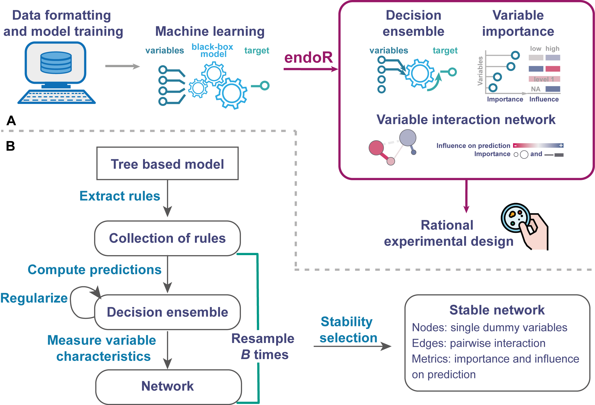

# endoR
Code and manual of the endoR R-package (Ruaud et al, in preparation).

- author: Albane Ruaud [albane.ruaud@tuebingen.mpg.de](mailto:albane.ruaud@tuebingen.mpg.de)
- maintainer: Albane Ruaud [albane.ruaud@tuebingen.mpg.de](mailto:albane.ruaud@tuebingen.mpg.de)

# Abstract
**Motivation:** Tree ensemble machine learning models are increasingly used in microbiome science to explore associations between microbes and their environment, as they are compatible with the compositional, high-dimensional, and sparse structure of sequence-based microbiome data. The complex structure of such models enables efficient capture of higher-order interactions to improve predictions, but makes the final model often difficult to interpret. Therefore, while tree ensembles are often the most accurate models for microbiome data, the approach often yields limited insight into how microbial taxa or genomic content may be associated with host phenotypes.

**Procedure:** endoR is a method that extracts and visualizes how predictive variables contribute to tree ensemble model accuracy. The fitted model is simplified into a decision ensemble and then reduced via regularization and bootstrapping to retain only the most essential aspects. Information about predictive variables and their pairwise interactions are extracted from the decision ensemble and displayed as a network for straightforward interpretation. The network and importance scores derived from endoR help understand how tree ensemble models make predictions from variables and interactions between variables.

# Usage

Before: select and fit a machine learning model (regression or classification)
-  random forest R-packages: randomForest, ranger 
- gradient boosted model R-packages: GBM, XGBoost 

1. Generate the **stable decision ensemble**:
	- without bootstrapping, opt. in parallel, with `model2DE()`
	- with bootstrapping, opt. in parallel, with `model2DE_resampling()`
	- with boostrapping each ran in parallel (recommended): `preCluster()` followed by `model2DE_cluster()` iterated on partitions in the `Q()` function of the clusterMQ R-package
2. If bootstrapping, perform **stability selection**: `stabilitySelection()`
3. Plot results with `plotFeatures()` and `plotNetwork()` (created with ggplot2, ggraph and igraph R-packages, arranged with the ggpubr R-package)

# Background

**From tree ensemble to decision ensembles**

A decision consist of a full branch of a decision tree: 
- all splits along the branch form the *rule* of the decision;
- the average response variable in the subset of observations following the rule corresponds to the *prediction* of the decision;
- the sample support is the set of observations that follow the rule;
- the error is the average deviation of the prediction to the observed resonse variable. 

**Decision importance**

We measure the decision importance by comparing the error of the decision to what could be expected by a random guessing (i.e., the coefficient of regression R2 for regressions and Cohen's kappa for classifications).

